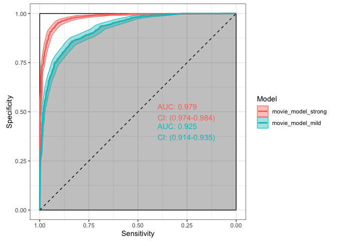
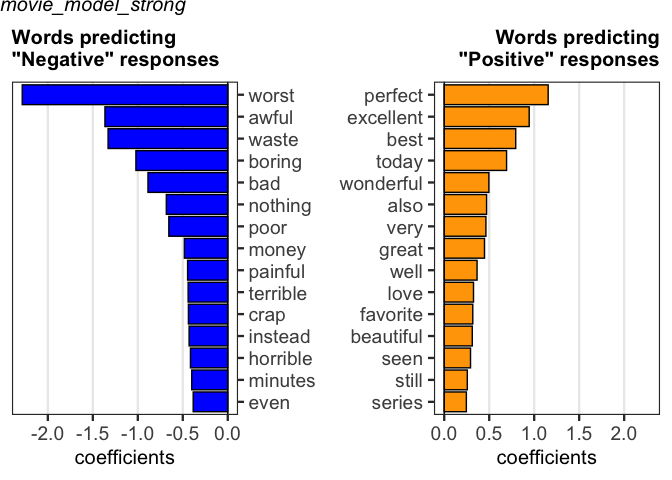
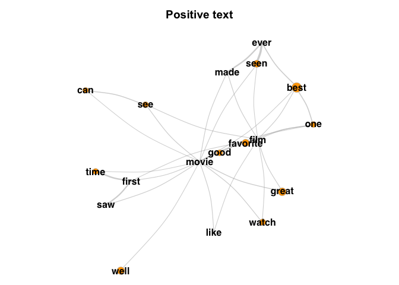
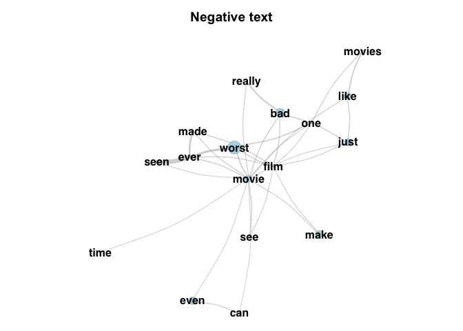
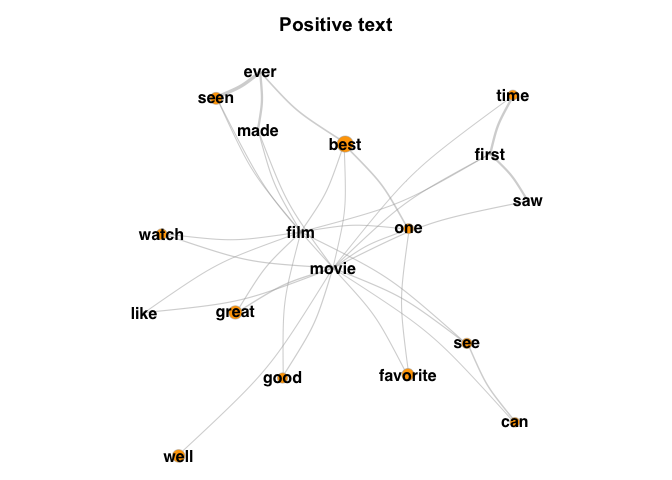

languagePredictR
================

***[PDF manual
here](https://github.com/nlanderson9/languagePredictR/blob/main/docs/languagePredictR_0.1.0.pdf)***
// ***[Interactive Demo
here](https://nlanderson9.shinyapps.io/languagePredictR_shiny_demo/)***

This package implements the analysis described in [Dobbins & Kantner
2019](https://www.sciencedirect.com/science/article/abs/pii/S0010027719301611).
It is intended to quantitatively assess natural language produced by
participants, and use language choices to predict binary or continuous
outcomes on a given measure.

To install:

``` r
# install.packages("devtools")
devtools::install_github("nlanderson9/languagePredictR")
```

``` r
library(languagePredictR)
```

This vignette walks through a potential use case: predicting IMDB movie
ratings (“Positive” vs. “Negative”, or a 1-10 star scale) from the text
accompanying the rating.

This package is designed to process data in three major phases:  
1. Cleaning/preparing text for analysis  
2. Creating a predictive model  
3. Assessing the model and comparing it to other models

We’ll start with a dataset of movie reviews from IMDB. The
`strong_movie_review_data` dataset has 3 columns:  
\* text: Text reviews of movies (e.g. “I don’t know why I like this
movie so well, but I never get tired of watching it.”)  
\* rating: A rating on a scale of 1-10 that accompanies the text  
\* valence: A label assigned based on the rating (“Positive” for ratings
6-10, “Negative” for ratings 1-5)

The `strong_movie_review_data` dataset contains 2000 reviews - 1000
positive, 1000 negative. Specifically, this dataset only contains
“strong” ratings - values of either 1 or 10.

### 1. Preparing Text

Here we are preparing the text for analysis. In its raw form, text
strings can cause a lot of problems - since this package analyzes text
on the word level, and is completely literal, any differences are
interpreted as meaningful. For example, “done.” and “done” are different
words, as are “don’t” and “do not.”

First, let’s clean the text:

``` r
strong_movie_review_data$cleanText = clean_text(strong_movie_review_data$text)
```

Here’s an example of how the text changes:

``` r
strong_movie_review_data$text[1740]
```

    ## [1] "Unwatchable. You can't even make it past the first three minutes. And this is coming from a huge Adam Sandler fan!!1"

``` r
strong_movie_review_data$cleanText[1740]
```

    ## [1] "unwatchable you can not even make it past the first three minutes and this is coming from a huge adam sandler fan"

There are other tools in this package to clean up text. These include:  
\* `check_spelling` - Corrects mis-spelled words  
\* `idiosync_response_words` - Removes words that occur repeatedly in a
single text response, but nowhere else - these might influence the model
in undesirable ways  
\* `idiosync_participant_words` - Similar to `idiosync_response_words`,
but if you have responses grouped by participant, it will remove words
used repeatedly by an individual participant and never by another
participant.  
\* `lemmatize` - Reduces words to their base units (e.g. “running” or
“ran” becomes “run,” “dogs” becomes “dog” and “geese” becomes “goose”)

### 2. Predict

Once the text is ready, it’s time to create our predictive model This is
done using the `language_model` function, the core function of this
package

All you need to specify is the outcome variable (in this case, we’re
using language choice to predict whether the review is Positive or
Negative) and what type the outcome variable is (here, a binary
variable)

``` r
movie_model_strong = language_model(strong_movie_review_data,
                                      outcome = "valence",
                                      outcomeType = "binary",
                                      text = "cleanText")
```

``` r
summary(movie_model_strong)
```

    ## Call:: language_model(input = strong_movie_review_data, outcome = "valence", outcomeType = "binary", text = "cleanText")
    ## 
    ## Number of language samples provided (n): 2000 
    ## Ngrams used: 1 
    ## Total number of ngrams in dataset: 434252 
    ## Number of unique ngrams in dataset to serve as predictors (p): 23413 
    ## Number of predictive ngrams in final model: 180 
    ##     Number of ngrams predicting 'Negative': 93
    ##     Number of ngrams predicting 'Positive': 87
    ## 
    ## Cross-validated Binomial Deviance at 'lambda.min' = 0.604
    ## 
    ## Various model evaluation metrics:
    ##    (Caution: these were obtained by using the cross-validated model to predict outcomes based on the original dataset)
    ## 
    ## Predictive accuracy: 0.929 
    ## Kappa: 0.858 
    ## Log loss: 0.223 
    ## ROC AUC: 0.979

Let’s compare our model with one based on another dataset:
`mild_movie_review_data`. This dataset is very similar, except these
reviews are more “mild” (4 and 7, instead of 1 and 10). Maybe people use
stronger, and more predictive, language for stronger reviews?

``` r
mild_movie_review_data$cleanText = clean_text(mild_movie_review_data$text)
movie_model_mild = language_model(mild_movie_review_data,
                                      outcome = "valence",
                                      outcomeType = "binary",
                                      text = "cleanText")
```

``` r
summary(movie_model_mild)
```

    ## Call:: language_model(input = mild_movie_review_data, outcome = "valence", outcomeType = "binary", text = "cleanText")
    ## 
    ## Number of language samples provided (n): 2000 
    ## Ngrams used: 1 
    ## Total number of ngrams in dataset: 522970 
    ## Number of unique ngrams in dataset to serve as predictors (p): 26724 
    ## Number of predictive ngrams in final model: 335 
    ##     Number of ngrams predicting 'Negative': 175
    ##     Number of ngrams predicting 'Positive': 160
    ## 
    ## Cross-validated Binomial Deviance at 'lambda.min' = 1.166
    ## 
    ## Various model evaluation metrics:
    ##    (Caution: these were obtained by using the cross-validated model to predict outcomes based on the original dataset)
    ## 
    ## Predictive accuracy: 0.845 
    ## Kappa: 0.69 
    ## Log loss: 0.405 
    ## ROC AUC: 0.925

### 3. Assess

A number of functions are provided to help us see what’s going on.

For binary models, `plot_roc` will give us a good visual overview:

``` r
plot_roc(movie_model_strong, movie_model_mild, individual_plot = FALSE, facet_plot = FALSE)
```

<!-- -->

As we can see, language does appear to predict review valence for both
datasets - but it’s higher for strong reviews! But is this significant?
Let’s check:

``` r
test_output = analyze_roc(movie_model_strong, movie_model_mild, plot=FALSE)
test_output
```

    ##               model1           model2 model1_auc model2_auc     p_value sig
    ## 1 movie_model_strong movie_model_mild   0.979426   0.924531 1.60408e-19 ***

It is !

Finally, let’s see what words the model is using to predict our outcome
variable. The LASSO constraint used to build the model reduces the
number of predictors significantly, so we can look at which words are
driving these predictions.

Even with the number of items reduced, it can sometimes be a lot to
plot. Let’s look at the top 15:

``` r
plot_predictor_words(movie_model_strong, movie_model_mild, topX = 15, print_summary = FALSE)
```

<!-- --><!-- -->

What do these words mean in context? We can investigate with the network
plotting tools. Let’s take a look at the movie\_model\_strong networks:

``` r
network_table = node_edge(movie_model_strong, removeStopwords = TRUE)
```

``` r
word_network(network_table, model=movie_model_strong, topX=50)
```

<!-- --><!-- -->
