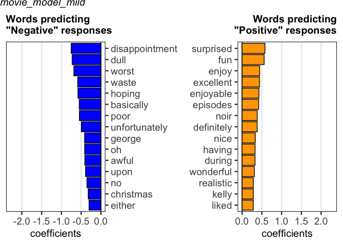

languagePredictR
================

This package implements the analysis described in [Dobbins & Kantner
2019](https://www.sciencedirect.com/science/article/abs/pii/S0010027719301611).
It is intended to quantitatively assess natural language produced by
participants, and use language choices to predict binary or continuous
outcomes on a given measure.

To install:

``` r
# install.packages("devtools")
devtools::install_github("nlanderson9/languagePredictR")
```

``` r
library(languagePredictR)
```

This vignette walks through a potential use case: predicting IMDB movie
ratings (“Positive” vs. “Negative”, or a 1-10 star scale) from the text
accompanying the rating.

This package is designed to process data in three major phases:  
1. Cleaning/preparing text for analysis  
2. Creating a predictive model  
3. Assessing the model and comparing it to other models

We’ll start with a dataset of movie reviews from IMDB. The
`strong_movie_review_data` dataset has 3 columns:  
*text: Text reviews of movies (e.g. “I don’t know why I like this movie
so well, but I never get tired of watching it.”)  
*rating: A rating on a scale of 1-10 that accompanies the text  
\*valence: A label assigned based on the rating (“Positive” for ratings
6-10, “Negative” for ratings 1-5)

The `strong_movie_review_data` dataset contains 2000 reviews - 1000
positive, 1000 negative. Specifically, this dataset only contains
“strong” ratings - values of either 1 or 10.

### 1. Preparing Text

Here we are preparing the text for analysis. In its raw form, text
strings can cause a lot of problems - since this package analyzes text
on the word level, and is completely literal, any differences are
interpreted as meaningful. For example, “done.” and “done” are different
words, as are “don’t” and “do not.”

First, let’s clean the text:

``` r
strong_movie_review_data$cleanText = clean_text(strong_movie_review_data$text)
```

Here’s an example of how the text changes:

``` r
strong_movie_review_data$text[1]
```

    ## [1] "Arnold once again in the 80's demonstrated that he was the king of action and one liners in this futuristic film about a violent game show that no contestant survives. But as the tag line says Arnold has yet to play! The movie begins in the year 2019 in which the world economy has collapsed with food and other important materials in short supply and a totalitarian state has arisen, controlling every aspect of life through TV and a police state. It's most popular game show is The Running Man, in which criminals are forced to survive against \"Stalkers\" that live to kill them.<br /><br />The movie opens with Ben Richards (Arnold) leading a helicopter mission to observe a food riot in progress. He is ordered by his superiors to fire on them, refusing to gets him knocked out and thrown in prison, in the meantime they slaughtered the people without his help. The government blames Richards for the massacre earning him the name \"Butcher of Bakersfield\". Eighteen months later Richards along with two friends William Laughlin (Koto) and Harold Weiss (McIntyre) breakout of a detention zone they worked in. They make their way to the underground, led by Mic (Mick Fleetwood). Mic quickly identifies Richards as the \"Butcher of Bakersfield\" and refuses to help him, but his friend's convince him otherwise. They want him to join the resistance, but he'd rather go live with his brother and get a job. Soon he finds that his brother has been taken away for reeducation and a woman name Amber Mendez (Alonso) has taken his apartment. Knowing who he is she won't help him, but he convinces her, but is busted at the airport by the cops after she ratted him out.<br /><br />Meantime, The Running man is having trouble finding good new blood for the there stalkers to kill. Damon Killian (Dawson) the shows host and one of the most powerful men in the country sees Richards escape footage and is able to get him for the show after his capture. Richards refuses to play, Killian threatens to use his friends instead of him, so he signs the contract. You'll love that part. But soon he finds they will join him as well and makes sure Killian knows he'll be back. The Runners begin to make there way through the Zones and fight characters that are memorable, Sub-Zero, Buzz Saw and many others. Eventually Richards is joined by Amber who suspected he was set up but was caught and thrown into the game too. Together they find the underground and make there way back to Killian and give him a farewell send off.<br /><br />The running man is another one of Arnold's great movies from the 80's. The movie was apparently somewhat based on Stephen King's book of the same name. Some have said that the book is better. I'm sure it's not and I don't care anyway I loved the movie. As in all of Arnold's films the acting is what you would expect with classic one liners from Arnold and even Ventura gets a couple in. But without a doubt Richard Dawson is the standout in this film. Being a real game show host he easily spoofed himself and was able to create a character that was truly cold blooded. The whole movie itself somewhat rips on game shows and big brother watching you. Keep an eye out for them poking fun and some old shows, \"hate boat\" among others. Also the cast was great besides Arnold, Koto, and Alonzo don't forget Professor Toru Tanaka, Jim Brown, Ventura and Sven-Ole! With all the reality TV nonsense that goes on it almost fits in better now, but I'm sure the Hollywood liberals would make it into a movie about the \"Evil Bush\". The new DVD had mostly poor extras meet the stalkers being the only redeemable one. Some how the ACLU managed to get some of there communism into the DVD and is laughable garbage that should not be anywhere near an Arnold movie of all things. Blasphemy! Overall for any Arnold fan especially we who grew up in the 80's on him ,you can't miss this. Its one of the first ones I saw back in the 80's and it's still great to this day. The futuristic world and humor are great. Overall 10 out 10 stars, definitely one of his best."

``` r
strong_movie_review_data$cleanText[1]
```

    ## [1] "arnold once again in the demonstrated that he was the king of action and one liners in this futuristic film about a violent game show that no contestant survives but as the tag line says arnold has yet to play the movie begins in the year in which the world economy has collapsed with food and other important materials in short supply and a totalitarian state has arisen controlling every aspect of life through tv and a police state it is most popular game show is the running man in which criminals are forced to survive against stalkers that live to kill them the movie opens with ben richards arnold leading a helicopter mission to observe a food riot in progress he is ordered by his superiors to fire on them refusing to gets him knocked out and thrown in prison in the meantime they slaughtered the people without his help the government blames richards for the massacre earning him the name butcher of bakersfield eighteen months later richards along with two friends william laughlin koto and harold weiss mcintyre breakout of a detention zone they worked in they make their way to the underground led by mic mick fleetwood mic quickly identifies richards as the butcher of bakersfield and refuses to help him but his friend convince him otherwise they want him to join the resistance but he would rather go live with his brother and get a job soon he finds that his brother has been taken away for reeducation and a woman name amber mendez alonso has taken his apartment knowing who he is she will not help him but he convinces her but is busted at the airport by the cops after she ratted him out meantime the running man is having trouble finding good new blood for the there stalkers to kill damon killian dawson the shows host and one of the most powerful men in the country sees richards escape footage and is able to get him for the show after his capture richards refuses to play killian threatens to use his friends instead of him so he signs the contract you will love that part but soon he finds they will join him as well and makes sure killian knows he will be back the runners begin to make there way through the zones and fight characters that are memorable sub zero buzz saw and many others eventually richards is joined by amber who suspected he was set up but was caught and thrown into the game too together they find the underground and make there way back to killian and give him a farewell send off the running man is another one of arnold great movies from the the movie was apparently somewhat based on stephen king book of the same name some have said that the book is better i am sure it is not and i do not care anyway i loved the movie as in all of arnold films the acting is what you would expect with classic one liners from arnold and even ventura gets a couple in but without a doubt richard dawson is the standout in this film being a real game show host he easily spoofed himself and was able to create a character that was truly cold blooded the whole movie itself somewhat rips on game shows and big brother watching you keep an eye out for them poking fun and some old shows hate boat among others also the cast was great besides arnold koto and alonzo do not forget professor toru tanaka jim brown ventura and sven ole with all the reality tv nonsense that goes on it almost fits in better now but i am sure the hollywood liberals would make it into a movie about the evil bush the new dvd had mostly poor extras meet the stalkers being the only redeemable one some how the aclu managed to get some of there communism into the dvd and is laughable garbage that should not be anywhere near an arnold movie of all things blasphemy overall for any arnold fan especially we who grew up in the on him you can not miss this its one of the first ones i saw back in the and it is still great to this day the futuristic world and humor are great overall out stars definitely one of his best"

There are other tools in this package to clean up text. These include:  
*`check_spelling` - Corrects mis-spelled words  
*`idiosync_response_words` - Removes words that occur repeatedly in a
single text response, but nowhere else - these might influence the model
in undesirable ways  
*`idiosync_participant_words` - Similar to `idiosync_response_words`,
but if you have responses grouped by participant, it will remove words
used repeatedly by an individual participant and never by another
participant.  
*`lemmatize` - Reduces words to their base units (e.g. “running” or
“ran” becomes “run,” “dogs” becomes “dog” and “geese” becomes “goose”)

### 2. Predict

Once the text is ready, it’s time to create our predictive model This is
done using the `language_model` function, the core function of this
package

All you need to specify is the outcome variable (in this case, we’re
using language choice to predict whether the review is Positive or
Negative) and what type the outcome variable is (here, a binary
variable)

``` r
movie_model_strong = language_model(strong_movie_review_data,
                                      outcomeVariableColumnName = "valence",
                                      outcomeVariableType = "binary",
                                      textColumnName = "cleanText")
```

### 3. Assess

There’s not much we can do with this model output without assessing it.
When we assess the model, we can do so in conjunction with other models
in order to compare them. Let’s compare our model with one based on
another dataset: `mild_movie_review_data`. This dataset is very similar,
except these reviews are more “mild” (4 and 7, instead of 1 and 10).
Maybe people use stronger, and more predictive, language for stronger
reviews?

``` r
mild_movie_review_data$cleanText = clean_text(mild_movie_review_data$text)
movie_model_mild = language_model(mild_movie_review_data,
                                      outcomeVariableColumnName = "valence",
                                      outcomeVariableType = "binary",
                                      textColumnName = "cleanText")
```

Now, we can assess our models:

``` r
movie_assessment = assess_models(movie_model_strong, movie_model_mild)
```

This “model\_assessment” object can be used with a number of functions
to help us see what’s going on.

For binary models, `plot_roc` will give us a good visual overview:

``` r
plot_roc(movie_assessment, individual_plot = FALSE, facet_plot = FALSE)
```

<!-- -->

As we can see, language does appear to predict review valence for both
datasets - but it’s higher for strong reviews! But is this significant?
Let’s check:

``` r
test_output = analyze_roc(movie_assessment, plot=FALSE)
test_output
```

    ##               model1           model2 model1_auc model2_auc      p_value sig
    ## 1 movie_model_strong movie_model_mild   0.979426   0.909267 1.375084e-25 ***

It is !

Finally, let’s see what words the model is using to predict our outcome
variable. The LASSO constraint used to build the model reduces the
number of predictors significantly, so we can look at which words are
driving these predictions.

Even with the number of items reduced, it can sometimes be a lot to
plot. Let’s look at the top 15:

``` r
plot_predictor_words(movie_assessment, topX = 15, print_summary = FALSE)
```

<!-- --><!-- -->
